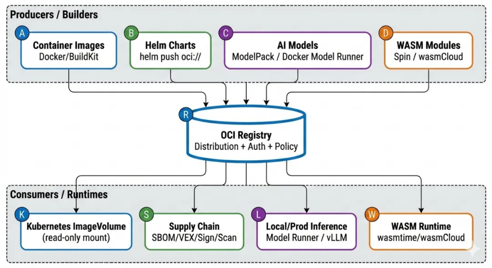
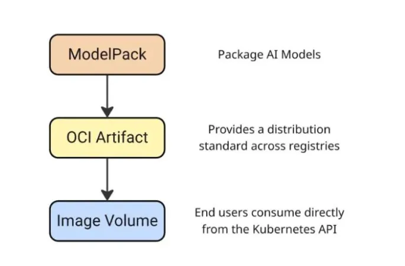

# OCI 正在悄悄「占领一切」

> —— 从容器镜像到 AI 模型，OCI 成为统一制品分发底座

前阵子 KubeCon North America（亚特兰大那场）结束后，有篇文章总结得特别到位：OCI 正在悄悄地把各种东西都装进自己的体系。作者是 MetalBear，他们观察到，OCI 已经不只是容器镜像的打包格式，而是慢慢变成了云原生生态里事实上的默认分发方式和仓库形态。Helm Chart、WASM 模块，甚至 AI 模型，都在往 OCI Registry 上面靠。

这个变化不是谁突然发了一篇宏大宣言，而是工程上一步步被逼出来的现实选择。

最直接的原因是：Registry 里要放的东西变了。以前主要是可执行的软件镜像，现在越来越多的是“不可执行但超级重要”的资产——模型权重、数据集片段、策略文件、SBOM、VEX、插件、WASM 组件等等。企业这边早就有成熟的 Registry 基础设施：权限管理、镜像扫描、安全审计、供应链治理一条龙。重新搞一套专属的“模型仓库”协议栈，成本高、风险大、落地慢。复用现有的 OCI Registry 显然更省事。

Docker 自己解释为什么选 OCI Artifacts 来打包 AI 模型时，理由也很直白：能直接沿用已有的 registry 和 CI/CD 流程，将来跟 containerd、Kubernetes 深度打通也更容易。

## 为什么 AI 时代更需要 OCI：从镜像到制品分发底座

AI 工作负载把“分发”这件事情的难度直接拉高了好几个量级。

- **体积太大**：一个模型加运行环境，动不动几十 GiB。分发效率直接决定部署速度和系统稳定性。containerd v2.2 里新加的 Rebase Snapshot，就是为了优化超大镜像的下载体验，本质上是更充分地用好 OCI Distribution 的分段下载和断点续传。

- **可追溯和合规要求高**：AI 系统必须能回答“这个模型哪来的？谁做的？有没有被改过？合不合公司策略？”这类问题。这就要求分发链路天生支持 SBOM、签名、溯源、策略校验，还得跟现有的容器安全工具链无缝对接。Docker 的 Hardened Images 已经把可验证构建、溯源证明当成默认安全底线，也在推这个方向。

- **不想维护多套仓库**：没几个团队愿意长期同时养着“镜像仓库 + Helm 仓库 + 模型仓库 + 插件仓库 + WASM 仓库”五六套系统。把所有制品统一塞进 OCI Registry，是目前最务实、省心的办法。

所以 OCI 现在已经从一个具体的“镜像格式”，慢慢抽象成了一种通用能力：用同一套 Registry 基础设施，搞定不同类型制品的分发、版本管理和治理。CNCF 官方博客也专门聊过，OCI Artifacts 会怎么驱动未来的 AI 场景。

## Kubernetes：OCI Image Volume 正在成为模型进入集群的标准入口

要让 OCI 制品真正跑到运行时，Kubernetes 的路线其实挺清晰。

从 v1.31 开始（Alpha），引入了基于 OCI Artifacts 的只读卷（Image Volume Source），可以声明式地把配置、模型等从 Registry 直接拉下来挂到 Pod 里。
v1.33 升到 Beta，文档和例子也更完善。
到 v1.35，虽然还没正式 GA，但只要底层运行时支持containerd v2.1+，默认就已经开了。

这个功能解决的是一个老大难问题。以前想给 Pod 用模型或配置，要么直接塞进应用镜像（镜像胖得要死，改一下全重拉），要么 initContainer 启动时下载（慢、不透明、难审计）。Image Volume 把“运行镜像”和“运行所需的数据/模型”彻底拆开，分发路径统一收归 OCI Registry。

## ModelPack：给模型一个 OCI 世界里的“身份证”

Kubernetes 提供了“怎么挂载”的机制，ModelPack 则在解决“模型该怎么打包成 OCI 制品”。

ModelPack 的 model-spec 明确说，AI 模型已经进入中心化基础设施的时代。它跟 OCI image spec 和 artifacts 指南高度兼容，还特意提到可以直接当 Kubernetes Image Volume Source 用。简单说：Kubernetes 给入口，ModelPack 给规范，两者一结合，就搭出了 AI 时代 OCI 分发的完整工程闭环。

在这一流程中，AI 模型首先按照 ModelPack 规范被打包成 OCI Artifact，通过标准的 OCI Distribution 协议分发到 Registry，最终由 Kubernetes 通过 Image Volume 机制直接消费。

## Harbor：从镜像与 Chart 仓库，走向模型制品仓库

Harbor 的演进也印证了这一趋势。在 v2.14.0 的发布说明中，Harbor 明确提到增强了 CNAI 模型集成能力，并支持原生的 CNAI 模型格式。这意味着，模型正在被正式纳入 Harbor 的 artifact 体系，而不是作为一个独立的“模型孤岛”存在。

结合 Harbor 社区提出的 AI Model Processor 方案以及相关实现 Issue，可以看到 Harbor 正在尝试把模型与现有的扫描、复制、代理缓存和权限治理能力结合起来，为企业提供统一的制品治理体验。

## Docker Model Runner：把本地推理与 OCI 分发直接焊在一起

Docker 在 AI 方向上几乎是双线并进。

一方面，它明确选择 OCI Artifacts 作为模型分发的基础形式；另一方面，它在推理引擎层提供了统一入口。Docker Model Runner 同时支持 llama.cpp 与 vLLM，并能够根据模型格式进行智能路由：GGUF 模型走 llama.cpp，safetensors 模型走 vLLM。关键在于，这两种模型格式都可以被当作 OCI 镜像推送和拉取，存放在任何兼容的 OCI Registry 中。

进一步地，Docker 还打通了 Model Runner 与 Hugging Face 的本地运行入口，让“从模型发现到本地推理”的体验，尽可能接近开发者熟悉的 `docker pull` 工作流。

## ORAS：OCI Artifacts 的瑞士军刀

如果说 OCI Registry 是统一制品分发的高速公路，那么 ORAS 的角色更像是一辆不限定车型的通用运输工具。它的设计初衷非常明确：不要假设 Registry 里存放的一切都是“容器镜像”，而是把 Registry 视为一个通用制品存储与分发系统。

在工程实践中，这一点尤为关键。模型权重、WASM 组件、SBOM、策略文件、插件包等资产，往往并不符合传统镜像的语义，却同样需要版本化管理、签名校验、访问控制以及跨环境复制能力。ORAS 提供的 CLI 与多语言 SDK，正是为这些“非镜像制品”而生，它允许开发者以 OCI Distribution 作为统一的底层协议，同时在上层保留足够的语义自由度。

更重要的是，ORAS 已经逐渐成为 OCI Artifacts 生态中的事实标准工具链。无论是模型分发、WASM 组件推送，还是安全元数据（如 SBOM、attestations）的附加与同步，许多方案都会默认选择 ORAS 作为实现基础。这使得 OCI 能够真正从“镜像中心”演进为“制品中心”，而不是停留在容器领域内部。

## Ollama 与类 Ollama 规范：先统一分发，再统一格式

Ollama 的流行并非偶然，它精准命中了开发者在大模型时代的核心诉求：从获取模型到运行模型，整个流程必须足够短、足够直觉。这种体验优先的设计，自然会催生出一套属于自己的模型组织方式、元数据描述以及运行约定。

但从企业级和云原生平台的视角来看，真正可持续的共识往往不会首先落在“模型格式统一”上。模型格式的多样性在短期内几乎不可避免，而更现实、摩擦也更小的切入点，是先统一分发协议与仓库兼容性。只要模型能够通过 OCI Distribution 被拉取、缓存和治理，格式差异带来的问题就被大幅压缩在可控范围内。

正因如此，像 ModelPack 这样的规范在设计时，并没有试图替代 Ollama，而是将其视为潜在的生态集成对象。先让模型在分发层面进入同一轨道，再逐步在元数据和规范层面收敛，是当前阶段最务实、也最符合工程演进规律的路径。

## WASM 制品库：OCI 的下一块统一拼图

WASM 模块和组件的分发需求，在结构上与模型分发高度相似：制品类型多、版本迭代快、运行环境异构，同时对签名验证和供应链治理有天然依赖。这使得 WASM 社区在较早阶段就开始寻找一种既足够通用、又能融入现有基础设施的分发方式。

OCI Registry 正是在这样的背景下，成为 WASM 分发的自然选择。通过将 WASM 模块或组件封装为 OCI Artifacts，生态可以直接复用现有的 Registry、权限模型、复制策略以及安全能力，而无需重新建设一套专用分发系统。无论是 wasmCloud、Fermyon Spin，还是 CNCF TAG Runtime 与云厂商的相关实践，都在不断强化这一方向。

从更宏观的视角来看，WASM 的加入进一步证明了一个事实：OCI 并不是“为容器而生”的专用技术，而是在演变为云原生世界的通用制品分发层。

## 行业信号：分发不再是理所当然的前提

一些看似与 OCI 没有直接关联的行业事件，实际上正在不断强化“分发底座必须可控”的共识。Bitnami 对其免费镜像和 Chart 分发策略的调整，就是一个典型例子。当公共目录的内容范围、可用性和策略发生变化时，依赖方往往缺乏足够的缓冲空间。

这类事件并不意味着公共生态不再重要，而是提醒我们：生产级系统不应把关键依赖完全押注在单一、不可控的外部源上。只有当制品能够以 OCI 的形式被同步、缓存并托管到企业自有 Registry 中，团队才真正掌握了分发的主动权。

与此同时，Docker 推出并开放 Docker Hardened Images，也在向行业传递一个清晰信号：分发、安全与溯源正在被视为基础能力，而非可选特性。OCI Registry 正是承载这些能力的核心基础设施之一。

## 性能与未来：大模型时代，OCI 仍在进化

当超大模型与“超级大镜像”成为常态后，OCI 生态在性能层面面临的新挑战也逐渐显现。传统的镜像拉取机制在面对几十 GiB 的制品时已经明显吃力，这正是 containerd v2.2 引入 Rebase Snapshot 等机制的现实背景。

这些优化并不是孤立出现的，它们本质上是在更充分地利用 OCI Distribution 在分段下载、并发传输和断点续传方面的能力。同时，在 OCI 社区内部，围绕 image spec 与 distribution spec 如何更好支持超大分发对象的讨论也在持续推进。可以预期，随着 AI 工作负载的普及，OCI 规范本身仍将不断演进，以适配更大规模、更高频率的制品分发需求。

## 一份务实的落地路线图

在实践层面，OCI 的落地并不需要一次性“推倒重来”，更现实的方式是一条循序渐进的演进路径。短期内，最容易落地、风险也最低的动作，是先把 Helm Chart 的分发全面迁移到 OCI Registry。Helm 官方已经提供了成熟的 `oci://` 工作流，这一步几乎不改变开发者的使用习惯，却可以立即减少对独立 Chart 仓库的依赖，为后续统一制品分发打下基础。

进入中期阶段，可以把 Registry 的角色从“镜像与 Chart 存储”扩展为“通用制品仓库”。在这一阶段，引入 ORAS 作为通用制品工具尤为关键。通过 ORAS，可以逐步把 SBOM、策略文件、签名材料以及模型相关的附件纳入 OCI Registry 进行管理，使这些原本散落在不同系统中的资产，开始享受统一的版本控制、访问权限和复制策略。这一步往往也是平台工程团队与安全、合规团队开始深度协作的阶段。

从中长期来看，真正体现 OCI 价值的，是运行时与调度层面的融合。随着 Kubernetes Image Volume 在新版本中默认启用，平台可以开始评估将模型、配置、插件等运行所需制品，通过 OCI Registry 直接挂载到 Pod 中。这要求底层运行时（如 containerd）同步升级，但带来的收益是显著的：应用镜像更轻量、模型与配置可独立演进，分发路径也变得可审计、可复现。

在这一过程中，推动 ModelPack 这样的模型规范与 Harbor 等企业级 Registry 的原生支持，将有助于形成完整的治理闭环。模型不再只是“被下载的文件”，而是成为可扫描、可复制、可追溯的制品，与镜像和 Chart 处于同一治理平面。

从更宏观的社区视角看，今天的模型分发仍然高度碎片化，但 OCI 已经成为最现实、也最具扩展性的统一桥梁。围绕 OCI 构建模型同步、离线分发和企业内网部署工具，将是未来一段时间内非常值得投入的工程方向。

## 写在最后

OCI 并没有通过一场高调的技术“革命”来宣告自己的存在，而是以一种极其工程化、低摩擦的方式，逐步渗透进云原生生态的各个角落。镜像、Chart、模型、WASM、SBOM 等原本分散在不同系统中的关键资产，正在被悄然拉到同一条分发轨道上。

在 AI 时代，这种统一并不只是为了架构优雅，而是为了可扩展性、可治理性以及长期的可持续演进。对于正在构建 AI Infra、平台工程或云原生底座的团队来说，OCI 很可能已经不是“要不要选”的问题，而是什么时候全面拥抱的问题。

## 题外话：MatrixHub

[MatrixHub](https://github.com/matrixhub-ai/matrixhub) 是 DaoCloud 最近开源的以 OCI 方式管理的 AI 模型镜像中心，旨在为企业和开发者提供一个自托管的模型仓库，方便管理、分发和版本控制当前主流的大语言模型。它让开发团队可以在内部安全地共享各类大模型，无需每次都依赖外部公共服务。

MatrixHub 兼容 Hugging Face 模型生态，并支持镜像方式管理模型，可自动缓存和同步最新版本。同时，MatrixHub 对 vLLM、SGLang 等高性能 AI 推理引擎进行了优化加速，大幅提升推理效率并降低网络延迟对业务的影响。

MatrixHub 还提供企业级功能，包括访问权限管理、多租户支持、审计日志和部署灵活性，支持 Docker 和 Kubernetes 环境，可轻松集成到现有 AI 工作流中，让大模型在生产环境中高效、稳定地运行。

## 参考资料

### KubeCon、CNCF 和 Kubernetes

- [KubeCon Atlanta Takeaways](https://metalbear.com/blog/kubecon-atlanta-takeaways/)
- [CNCF Blog - OCI Artifacts for AI](https://www.cncf.io/blog/2025/08/27/how-oci-artifacts-will-drive-future-ai-use-cases/)
- [Kubernetes v1.31 镜像卷源博客](https://kubernetes.io/blog/2024/08/16/kubernetes-1-31-image-volume-source/)
- [Kubernetes v1.35 发版博客](https://kubernetes.io/blog/2025/12/17/kubernetes-v1-35-release/)
- [k/website 镜像卷文档](https://kubernetes.io/docs/tasks/configure-pod-container/image-volumes/)

### ModelPack & Harbor

- [ModelPack model-spec](https://github.com/modelpack/model-spec)
- [Harbor v2.14.0 Release Notes](https://github.com/goharbor/harbor/releases/tag/v2.14.0)
- [Harbor Community Proposal](https://github.com/goharbor/community/blob/main/proposals/new/AI-model-processor.md)
- [Harbor AI Model Issue](https://github.com/goharbor/harbor/issues/21229)

### Docker

- [Why Docker Chose OCI Artifacts for AI Model Packaging](https://www.docker.com/blog/oci-artifacts-for-ai-model-packaging/)
- [Docker Model Runner + vLLM](https://www.docker.com/blog/docker-model-runner-integrates-vllm/)
- [Docker Model Runner on Hugging Face](https://www.docker.com/blog/docker-model-runner-on-hugging-face/)
- [Docker Hardened Images](https://docs.docker.com/dhi/)
- [Docker DHI Press Release](https://www.docker.com/press-release/docker-makes-hardened-images-free-open-and-transparent-for-everyone/)
- [Docker Hardened Images Blog](https://www.docker.com/blog/docker-hardened-images-for-every-developer/)

### 其他

- [ORAS Official Site](https://oras.land/)
- [Helm OCI Registries](https://helm.sh/docs/topics/registries/)
- [wasmCloud OCI Registries](https://wasmcloud.com/docs/deployment/netconf/registries/)
- [containerd v2.2.0 Rebase Snapshot](https://fuweid.com/post/2025-containerd-220-rebase-snapshot/)
- [OCI Image Spec Issue #1190](https://github.com/opencontainers/image-spec/issues/1190)
- [行业新闻：Bitnami Charts Catalog Changes (Aug 28, 2025)](https://github.com/bitnami/charts/issues/35164)
- [Docker Model Runner 携手 vLLM（公众号文章）](https://mp.weixin.qq.com/s/wGBiGjCuLnJHf3Z7hr25yQ)
- [OCI 制品如何推动未来的 AI 应用场景（公众号文章）](https://mp.weixin.qq.com/s/E-55ORZfoPWtIur7C9sIPg)
- [OCI 与容器镜像构建（公众号文章）](https://mp.weixin.qq.com/s/zMBkujlmQXL5yECbP7XSkg)
